# 3ds Max 2026 鲁班七号骨骼绑定教程 01：Biped 骨架创建与匹配

资料来源：

- 视频：原始视频仍保存在 `F:\workspace\open-share\video-downloads\BV1ftReBYEg3\`
- 逐字稿：`transcripts/BV1ftReBYEg3_transcript_cleaned.txt`
- 整理范围：`00:00:00` 到 `00:52:00`

说明：本文把逐字稿里的明显语音误识别统一修正为常用术语，例如“股格/股价/谷架”统一写作“骨骼/骨架”，“BPU”按上下文写作 “Biped”。前 52 分钟的重点不是蒙皮和刷权重，而是完成角色骨架的创建、参数配置、位置匹配，为后续 Skin 和权重制作打基础。

## 1. 本阶段目标

前 52 分钟要完成的事情可以拆成 5 个阶段：

1. 准备模型：删除无关模型，确认目标模型位置归零。
2. 建立骨架：使用 3ds Max 的 Biped 创建一套人体骨骼。
3. 设置参数：根据鲁班七号这种卡通手游角色的结构，设置脊椎、脖子、手指、脚趾、道具等骨骼数量。
4. 匹配模型：把骨骼点放到模型对应的关节点上，包括骨盆、腿、脚、躯干、锁骨、手臂、手指、脖子和头。
5. 检查可动画性：确保骨骼大小、方向、局部轴和关节弯曲方向合理，避免后续蒙皮和动画出问题。

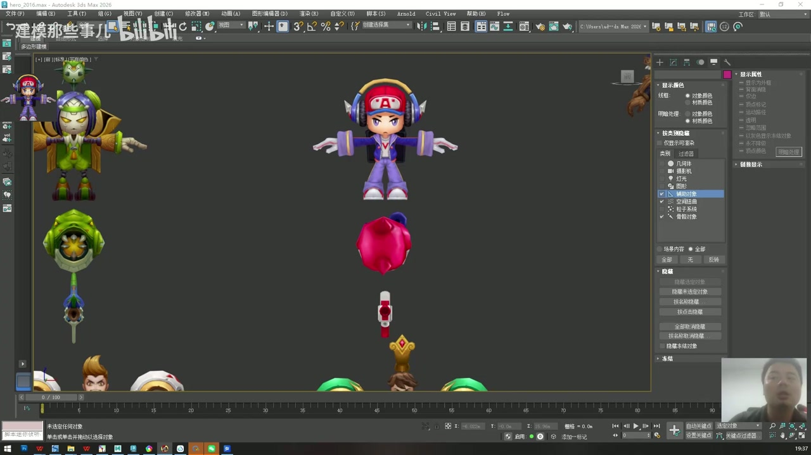

## 2. 模型准备与坐标归零

时间码：`00:00:00 - 00:03:10`

拿到模型后，先做基础整理。

1. 删除与当前练习无关的其他模型，只保留本次要绑定的鲁班七号模型和必要道具。
2. 选中目标模型，检查 Transform 里的位置数值。
3. 将 `X / Y / Z` 位置归零，让角色尽量站在世界坐标中心。
4. 检查模型朝向和站姿。这个阶段不用急着建骨骼，先确认模型本身是干净、可操作的。

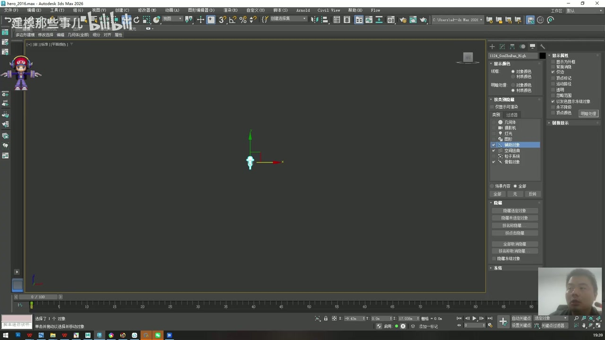

注意点：

- 角色骨架通常要围绕模型来搭，模型没归零会让后续骨骼匹配、镜像和导出变麻烦。
- 如果是项目资产，建议另存一份工作文件再操作，不要直接破坏原始文件。
- 游戏项目里可以使用中文命名，但为了跨工具、跨引擎和团队协作，文件和节点命名尽量少用中文。

## 3. 3ds Max 基础视图与快捷键

时间码：`00:03:10 - 00:04:30`

老师在正式建骨架前先强调了 3ds Max 的基础操作，因为骨骼匹配需要频繁切换视图、线框、移动和缩放。

常用变换快捷键：

| 操作 | 快捷键 |
| --- | --- |
| 移动 | `W` |
| 旋转 | `E` |
| 缩放 | `R` |
| 线框/实体切换 | `F3` |
| 边线显示 | `F4` |
| 最大化/还原视图 | `Alt + W` |

常用视图快捷键：

| 视图 | 快捷键 |
| --- | --- |
| 顶视图 | `T` |
| 透视图 | `P` |
| 前视图 | `F` |
| 左/侧视图 | `L` |

视图导航：

- `Alt + 鼠标中键`：旋转视图。
- `鼠标中键`：平移视图。
- `鼠标滚轮`：缩放视图。

操作建议：骨骼匹配时不要只看透视图。正面、侧面、顶面都要检查，尤其是腿、脚掌、手指、脖子这些有明显方向性的结构。

## 4. 认识两套骨骼系统：Bones 与 Biped

时间码：`00:04:30 - 00:07:45`

在 3ds Max 的系统面板里，常用的骨骼方案主要有两套：

1. 默认 Bones 骨骼系统。
2. Biped 骨骼系统。

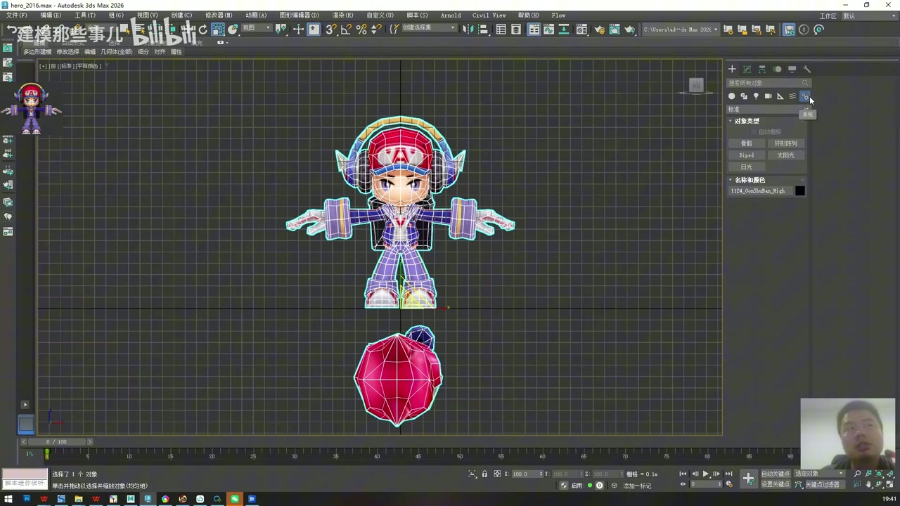

默认 Bones 的特点：

- 按点击顺序生成父子骨骼链。
- 第一根通常是主骨骼，后续骨骼跟随主骨骼。
- 适合模拟头发、表情、衣服、装备、挂件、武器、道具等非标准人体结构。

Biped 的特点：

- 快速生成一套人体骨架。
- 适合角色身体本体，比如骨盆、脊椎、腿、手臂、手指、头部。
- 后续可以用 Figure Mode 调整体型和关节位置。

实际项目结论：

- 身体主体用 Biped。
- 头发、装备、布料、武器、挂件、特殊道具可以用默认 Bones 或 Biped 的附加结构。
- 两套骨骼不是二选一，角色绑定里经常同时使用。

## 5. 创建 Biped 骨架

时间码：`00:08:20 - 00:10:55`

创建骨架时，关键不是“随便拖出一套人形骨骼”，而是从一开始就让骨架大致匹配模型。

操作步骤：

1. 切到 Biped 创建工具。
2. 开启 3D 捕捉，快捷键是 `S`。
3. 从世界坐标中心拉出 Biped。
4. 按 `F3` 切换线框视图，便于透过模型看骨骼。
5. 拖拽高度时，让 Biped 的整体高度接近角色模型，不要明显超出模型或过小。
6. 创建完成后，关闭捕捉，避免后续移动骨骼时误吸附。

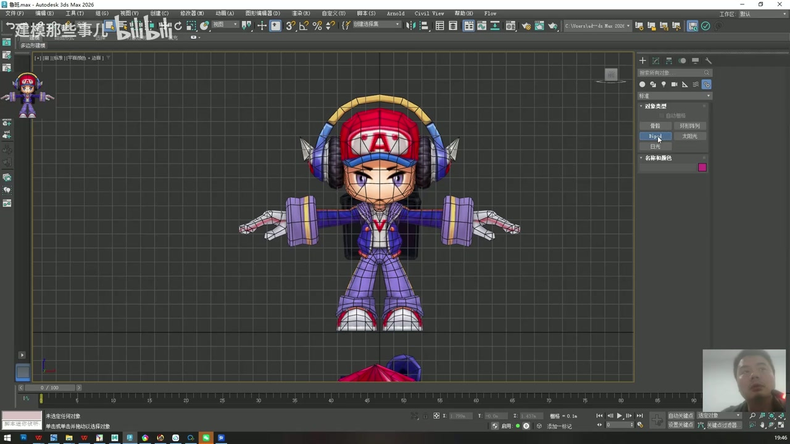

匹配时要关注的点：

- 锁骨
- 脖子
- 肩膀
- 大臂
- 手腕
- 手指关节
- 骨盆
- 膝盖
- 脚踝

这些点不是装饰，它们决定后面动作旋转的位置。骨点放错，蒙皮和权重再努力也会很难修。

## 6. 建立选择集：MOD 与 BIP

时间码：`00:11:00 - 00:12:20`

为了避免频繁误选模型或骨骼，先把模型和骨骼分组或建立选择集。

推荐做法：

1. 选中角色模型，创建选择集或集合，命名为 `MOD`。
2. 选中 Biped 根节点，创建选择集或集合，命名为 `BIP`。
3. 调整骨骼时，可以使用选择过滤，让当前只能选到骨骼，避免误选模型。

这样做的好处：

- 后续显示、隐藏、冻结、选择都会更快。
- 调骨架时不容易误拖模型。
- 文档、脚本和团队沟通里也更清晰。

## 7. 进入 Figure Mode 并打开结构参数

时间码：`00:12:20 - 00:14:20`

Biped 创建完成后，不要直接在普通模式下乱调。要进入 Biped 的体型编辑状态。

操作步骤：

1. 选中 Biped。
2. 进入 Motion 面板。
3. 在 Biped 参数里找到小人图标，开启 Figure Mode。
4. 开启后，骨骼可以被移动、旋转、缩放，用来匹配当前角色体型。
5. 将水平、垂直、旋转相关的轨道/轴都激活。如果一次只能选一个，先点小锁，再把另外两个一起打开。
6. 打开 `结构` 参数区，开始设置骨骼数量。

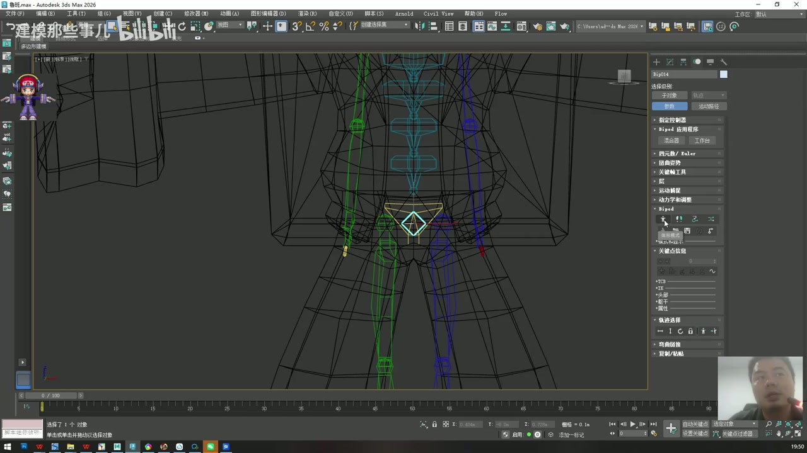

重点：只有进入 Figure Mode，当前这些调整才是在改“骨架体型”。后续蒙皮前，骨架体型必须先定好。

## 8. 设置 Biped 结构参数

时间码：`00:15:00 - 00:26:10`

这一段是在讲“每个部位到底要几节骨骼”。原则是：骨骼数量由模型结构和动画需求决定，不是越多越好。

### 8.1 脊椎：4 节改为 2 节

默认 Biped 的上半身脊椎可能是 4 节。对于鲁班七号这种卡通手游角色，老师建议改为 2 节：

- 第 1 节：腹部。
- 第 2 节：胸腔。

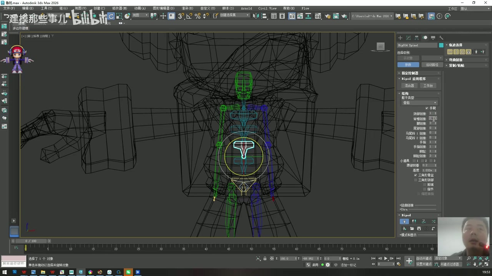

原因：

- 手游卡通角色体块简化，没必要做过细脊椎。
- 骨骼少一些，蒙皮和权重更容易控制。
- 腹部和胸腔能满足基础身体弯曲需求。

### 8.2 脖子：短脖子用 1 节

鲁班七号的脖子比较短，因此只保留 1 节脖子骨骼即可。

如果是长脖子怪物、异形角色、动物角色，就根据实际长度增加脖子骨骼数量。

### 8.3 腿：人形保持 3 节

人形腿部通常保持：

1. 大腿
2. 小腿
3. 脚

如果是四足动物，如马、牛、羊、老虎、狗等，腿部可能需要更多节数。鲁班七号是人形角色，不需要修改腿部默认三段结构。

### 8.4 辫子、角、长耳朵：没有就归零

这些属于附加结构：

- 马尾/辫子：按辫子长度决定骨骼数量。
- 角：有需要摆动或绑定的角才添加。
- 长耳朵：精灵耳、兽耳等需要摆动时添加。

鲁班七号没有头发辫子，也没有类似长耳朵结构，所以这些附加骨骼保持为 0。

### 8.5 手指：4 根，每根 3 节

鲁班七号不是标准 5 指，而是 4 根手指。设置时按模型来，不按真实人手来。

本角色建议：

- 手指数量：4
- 每根手指段数：3

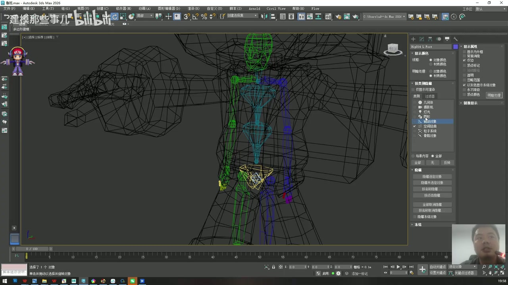

为什么每根 3 节：

- 正常手指弯曲至少要有 3 个关节段。
- 后续做握拳、张手、抓握时会更自然。
- 如果只保留 1 节，手指基本不能正常弯曲。

### 8.6 脚趾：穿鞋角色可简化为 1

鲁班七号穿着鞋，脚趾被鞋完全包住。此时不需要给每根脚趾建复杂骨骼。

建议：

- 脚趾数量或脚趾段数简化为 1。
- 这 1 节可以承担前脚掌的功能。

后续脚掌运动时，用脚骨和脚趾骨模拟后脚掌、前脚掌的抬起即可。

### 8.7 道具骨骼：用于武器和装备

结构参数里可能有 1、2、3 这类“小道具”骨骼。它们可以用来模拟角色武器或装备。

鲁班七号有枪、炮等道具时，有两种方案：

- 使用 Biped 附带的道具骨骼。
- 使用默认 Bones 单独为武器、装备做骨骼链。

选择哪种方案取决于项目规范和道具是否需要独立动画。

### 8.8 骨骼类型：默认、男性、女性

Biped 有默认、男性、女性等显示类型。老师强调，这主要是显示形态差异，不代表本质功能差很多。

建议：

- 初学者使用默认骨骼形态。
- 不要因为角色性别就盲目切换，重点还是骨点位置和动画需求。

## 9. 匹配骨盆和身体中心

时间码：`00:26:10 - 00:28:30`

参数设置完，只是确定了“有几节骨骼”。接下来要把骨骼真正摆到模型上。

第一步处理身体中心和骨盆。

操作步骤：

1. 显示模型。
2. 找到 Biped 的身体中心骨骼，也就是质心/重心骨骼。
3. 将它放到角色身体正中心。
4. 使用局部坐标和缩放工具，让骨盆骨骼大致包住模型骨盆区域。
5. 正面、侧面都检查一次，避免只在一个视角看起来对。

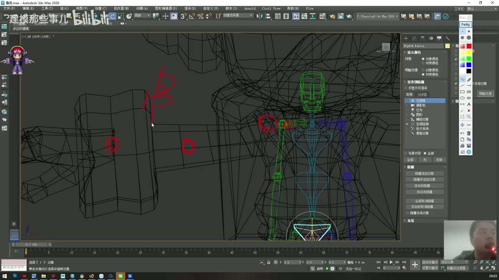

判断标准：

- 骨盆中心不要偏到模型外。
- 骨盆骨骼大小可以略大于网格，但不要夸张。
- 身体中心决定整体运动时的根部感觉，要谨慎放置。

## 10. 匹配腿部：膝盖、脚踝和脚掌

时间码：`00:28:30 - 00:34:20`

鲁班七号的腿不是完全竖直的，有一定八字姿态。因此腿部骨骼也要跟模型方向一致。

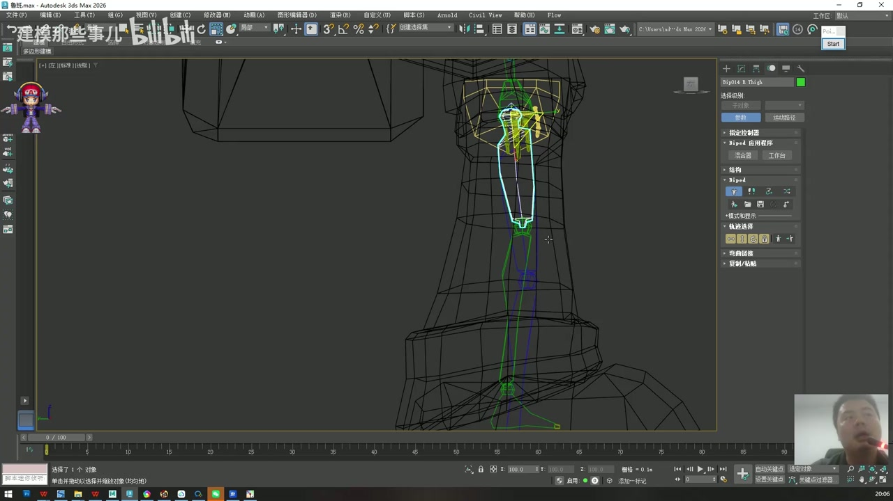

### 10.1 大腿和膝盖

操作步骤：

1. 选择大腿骨。
2. 使用局部坐标，单轴缩放或移动，让膝盖骨点落到模型膝盖位置。
3. 根据模型腿部方向，给腿部适当角度。
4. 不要把腿骨调成一条完全垂直的直线。

关键原则：

- 膝盖位置一定要和模型膝盖位置匹配。
- 腿部需要有自然弯曲方向，方便后续 IK 或动作弯曲。
- 如果骨骼完全笔直，后续膝盖可能不知道该往哪个方向弯。

### 10.2 小腿和脚踝

操作步骤：

1. 找到鞋子和腿连接处，作为脚踝参考。
2. 调整小腿长度，使脚踝骨点落在正确位置。
3. 保持小腿骨骼方向与模型腿部方向一致。

### 10.3 脚掌和前脚掌

鲁班七号鞋子比较大，脚骨也要适当放大，让骨骼包裹住模型。

脚部可以理解为：

- 后脚掌：脚跟到脚掌主体。
- 前脚掌：脚掌前端或脚趾区域。

虽然角色穿鞋，看不到真实脚趾，但脚趾骨可以用来模拟前脚掌抬起。后续走路时，脚跟离地、前脚掌弯曲都依赖这个结构。

### 10.4 镜像另一侧腿

一侧腿调好后，不需要手工再调另一侧。

操作步骤：

1. 双击选择已经调好的腿部骨骼链。
2. 打开 Biped 的复制/粘贴面板。
3. 选择局部状态/姿态复制，不要选择整套 Pose。
4. 确认预览里红色部分是你选中的骨骼。
5. 使用反向粘贴，把这一侧镜像到另一侧。

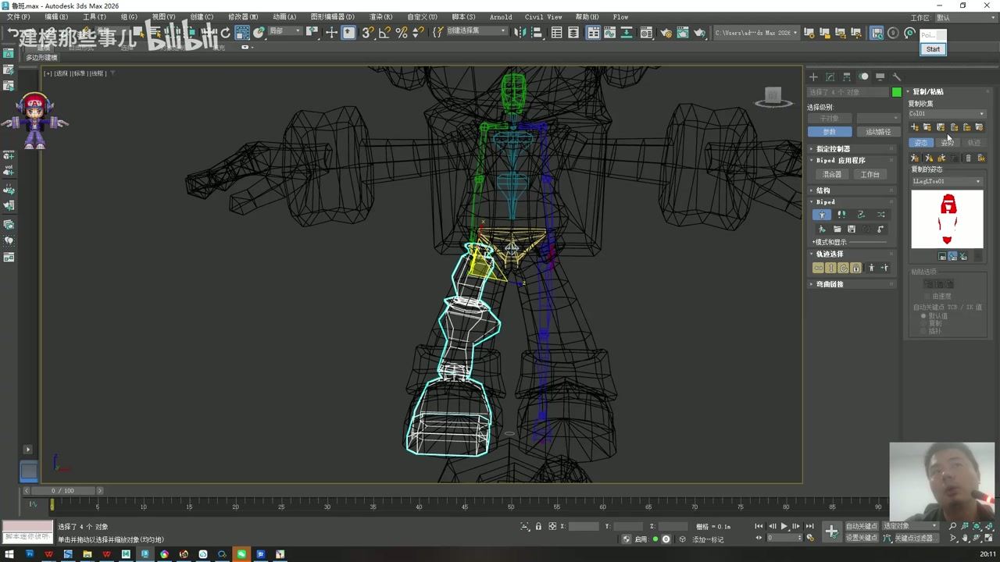

注意：镜像后仍然要检查另一侧，因为模型左右如果有不对称细节，可能还需要微调。

## 11. 匹配躯干：腹部、胸腔和侧面姿态

时间码：`00:35:45 - 00:37:20`

腿部完成后，开始处理上半身。

老师给出的比例经验：

- 腹部可以短一点。
- 胸腔可以长一点。
- 侧面看，身体可能略微后仰，不一定是完全竖直。

操作步骤：

1. 选中腹部和胸腔骨骼。
2. 使用局部坐标单轴调整。
3. 从侧面图检查脊椎方向。
4. 让骨骼模拟模型身体本身的姿态，而不是强行摆成标准直立人。
5. 适当放大胸腔和腹部骨骼，使其包裹模型。

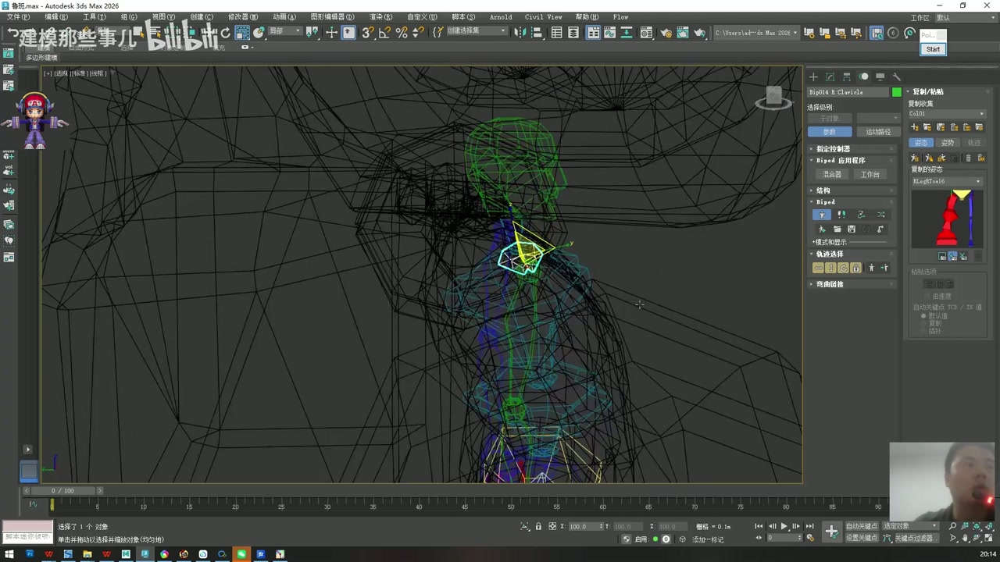

核心判断：骨骼应该服务于这个具体模型。卡通角色的比例夸张，不能完全照搬写实人体。

## 12. 匹配锁骨、手臂和手腕

时间码：`00:37:20 - 00:40:30`

锁骨是控制手臂的重要结构，不能忽略。

操作步骤：

1. 选择锁骨骨骼。
2. 如果锁骨过高，向下调整。
3. 如果锁骨过长，使用局部缩放缩短。
4. 将锁骨放到模型肩部和躯干连接位置。
5. 调整大臂，让肩膀到手肘的骨骼对齐模型大臂。
6. 调整小臂，让手肘到手腕的骨骼对齐模型小臂。
7. 调整手腕骨骼，使它落在模型手腕位置。

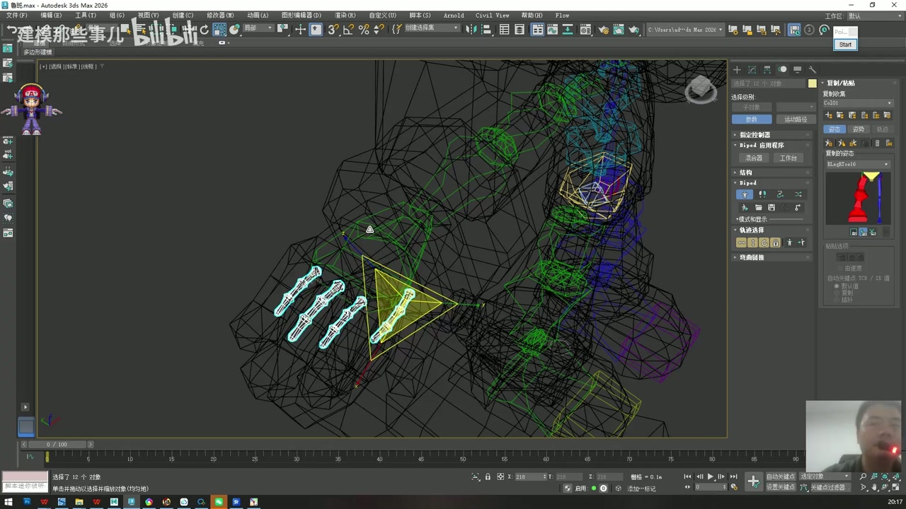

注意点：

- 大臂和小臂之间的转折点就是手肘。
- 手肘骨点位置很重要，决定后续弯曲是否自然。
- 调整时尽量使用局部坐标，少用世界坐标硬拖。
- 正面看对齐后，也要从侧面或透视角检查是否偏前偏后。

老师强调：骨骼前期设置得好不好，会直接影响后期动画。手臂尤其明显，因为肩、肘、腕都会参与大幅度动作。

## 13. 匹配手指：先三根普通手指，再处理大拇指

时间码：`00:40:30 - 00:50:10`

手指是前 52 分钟里非常关键的一段。它看起来只是小骨骼，但会直接影响握拳、抓握、指向等动作。

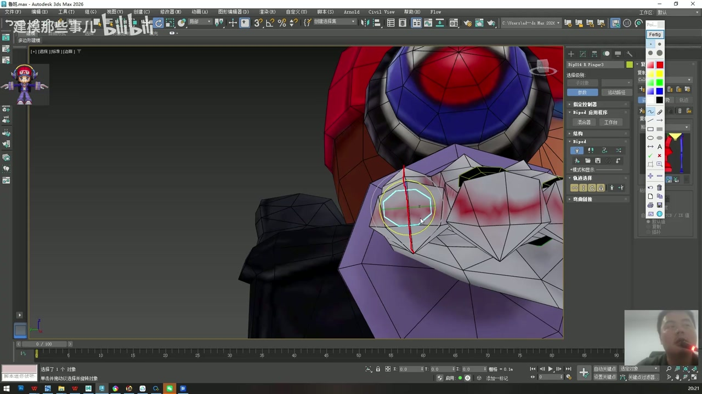

### 13.1 先整体放大手指骨骼

创建出来的手指骨骼可能偏小。先选中手指骨骼，整体适当放大，使每根手指骨骼能覆盖到模型手指区域。

### 13.2 先调普通三根手指

老师建议先调除大拇指外的三根手指，因为它们的运动方向比较统一：

- 主要沿一个方向弯曲。
- 关节方向相对一致。
- 更容易用顶视图和线框模式检查。

操作步骤：

1. 切到顶视图，快捷键 `T`。
2. 使用 `F3` 线框模式。
3. 选中某一根手指主骨。
4. 移动到对应手指模型的位置。
5. 调整第一、第二、第三节骨骼，让每个骨点落在手指自然弯曲位置。
6. 其他两根普通手指按同样方法处理。

### 13.3 检查手指局部轴方向

这一点是老师反复强调的“小技巧”。

判断标准：

- 手指骨骼的局部轴，尤其画面里蓝色轴向，要和模型手指的走向保持一致。
- 如果骨骼轴线偏了，后续弯曲会不自然。
- 不能只把骨骼“放到手指上”，还要把骨骼“转到正确方向”。

错误情况：

- 骨骼在位置上看似贴着手指，但局部轴和手指模型线条不一致。
- 后续做弯曲时，手指可能扭转、歪斜或出现奇怪的变形。

正确做法：

- 从顶视图观察手指模型的长轴。
- 旋转骨骼，让骨骼轴与这条长轴一致。
- 每一节指骨都要顺着手指结构摆放。

### 13.4 大拇指单独处理

大拇指不要和其他三根手指一起用同一套思路处理。

原因：

- 大拇指不是简单上下弯曲。
- 它有对掌方向，会涉及多个轴向运动。
- 它的骨骼需要旋转后再拉到模型对应位置。

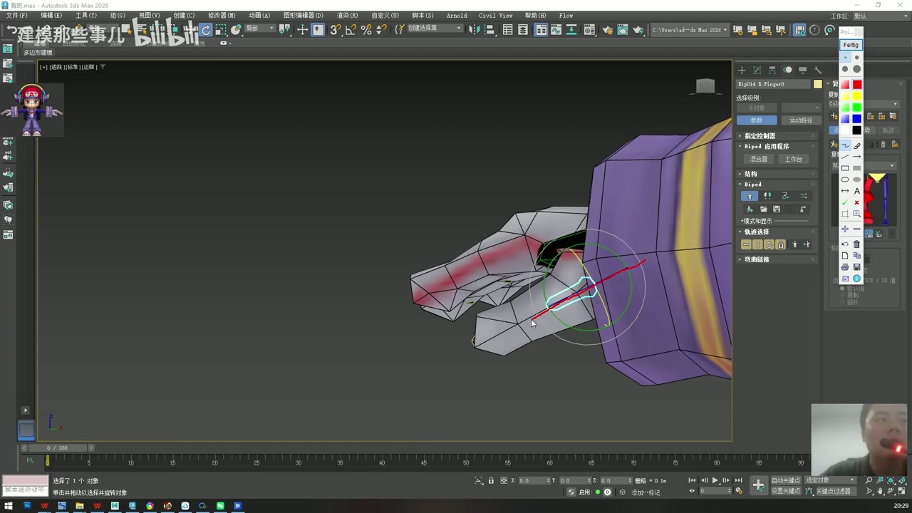

操作步骤：

1. 单独选择大拇指骨骼链。
2. 先旋转到与模型大拇指大致一致的方向。
3. 再移动到大拇指模型上。
4. 调整每节骨骼位置。
5. 检查局部轴是否沿着大拇指模型走向。

大拇指处理完后，可以选择整套手臂或手部骨骼，用 Biped 的复制/反向粘贴，把设置同步到另一侧。

## 14. 匹配脖子和头部

时间码：`00:51:16 - 00:52:00`

前 52 分钟最后进入脖子和头部。

鲁班七号的头很大，脖子很短，所以处理方式要符合角色比例。

操作步骤：

1. 从侧面图观察脖子长度。
2. 使用 1 节脖子骨骼即可。
3. 将脖子骨骼放到头和身体之间的短连接区域。
4. 适当放大脖子骨骼，使它覆盖模型脖子。
5. 选择头部骨骼，放大并拉长，让它覆盖大头区域。
6. 从侧面检查头骨方向，尽量让头部骨骼顺着头部体块走向。

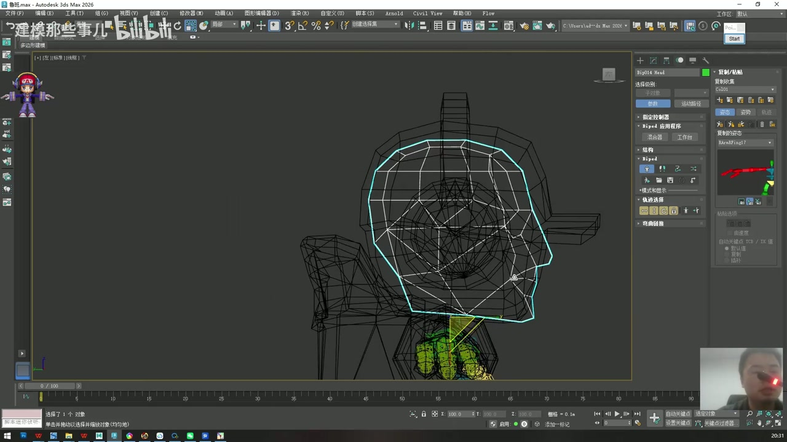

注意：卡通角色常常头大、脖子短、身体比例夸张。头骨不需要按写实人体大小设置，而要根据模型体块来包裹。

## 15. 前 52 分钟完成后的检查清单

完成本阶段后，先按下面清单检查，再进入蒙皮和权重。

### 模型与文件

- 目标模型已归零到世界中心附近。
- 已另存工作文件。
- 模型和骨骼有清晰选择集，例如 `MOD`、`BIP`。

### Biped 参数

- 脊椎设置为适合角色的数量，本例为 2。
- 脖子按模型长度设置，本例为 1。
- 手指数量按模型设置，本例为 4。
- 手指段数满足弯曲需求，本例为 3。
- 脚趾在穿鞋角色上已简化。
- 不需要的辫子、角、长耳朵等附加骨骼没有乱开。

### 骨点位置

- 骨盆中心在身体中心。
- 膝盖骨点落在模型膝盖处。
- 脚踝骨点落在鞋和腿的连接处。
- 脚掌骨骼能覆盖大鞋子，并保留前脚掌功能。
- 腹部、胸腔跟随模型侧面姿态。
- 锁骨在肩部合理位置。
- 手肘、手腕骨点准确。
- 手指三段骨骼按指节摆放。
- 脖子和头部符合短脖子、大头比例。

### 轴向和可动画性

- 腿部保留自然弯曲，不是完全笔直。
- 膝盖方向与模型腿部方向一致。
- 手指局部轴与手指模型走向一致。
- 大拇指单独旋转匹配，没有套用普通手指方向。
- 左右两侧镜像后已二次检查。

## 16. 常见错误

1. Biped 高度随手拖，和模型比例不匹配。
2. 没有进入 Figure Mode 就开始乱调骨骼。
3. 脊椎、手指、脚趾数量照默认值使用，不按模型结构修改。
4. 穿鞋角色仍然创建复杂脚趾骨。
5. 腿部调成完全笔直，导致后续膝盖弯曲方向不清楚。
6. 只看正面，不检查侧面和顶视图。
7. 手指只对位置，不对局部轴方向。
8. 大拇指按普通手指处理，导致对掌方向错误。
9. 镜像时复制了整套 Pose，而不是局部骨骼状态。
10. 骨骼太小，没有覆盖模型体块，后续蒙皮权重难调。

## 17. 本阶段产出

到 `00:52:00`，你应该得到一套已经初步匹配鲁班七号模型的 Biped 骨架：

- 身体骨架已经按角色比例改好。
- 腿、脚、躯干、手臂、手指、脖子、头已经摆到模型对应位置。
- 手指轴向和大拇指方向经过检查。
- 后续可以继续进入蒙皮、权重和动画测试阶段。

这部分的核心不是“把骨骼放进去”，而是“让每个骨点和每根骨骼都服务于后续运动”。如果这一关做扎实，后面的 Skin 和权重会轻松很多。
