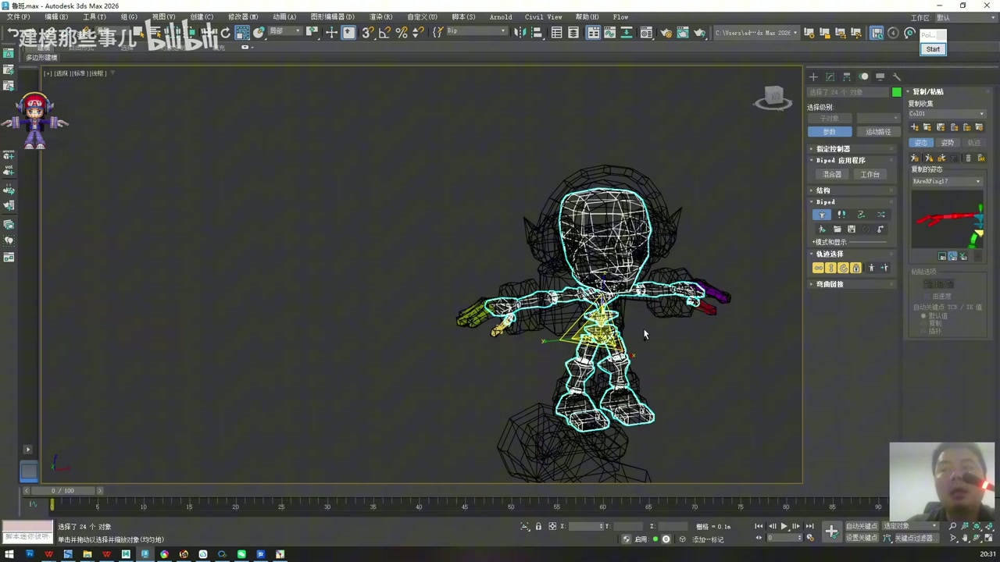
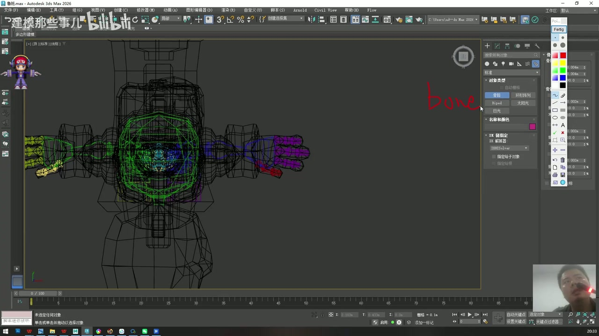
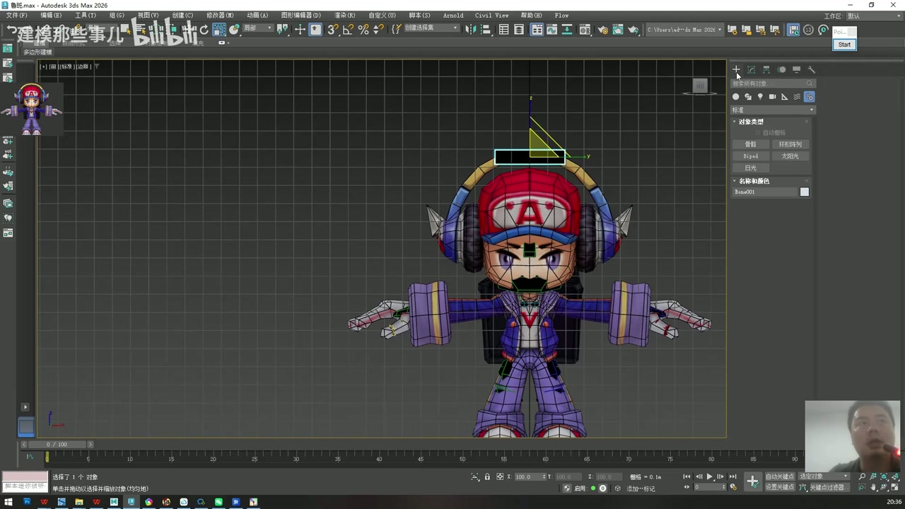
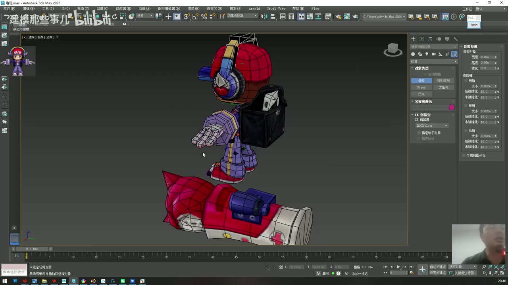
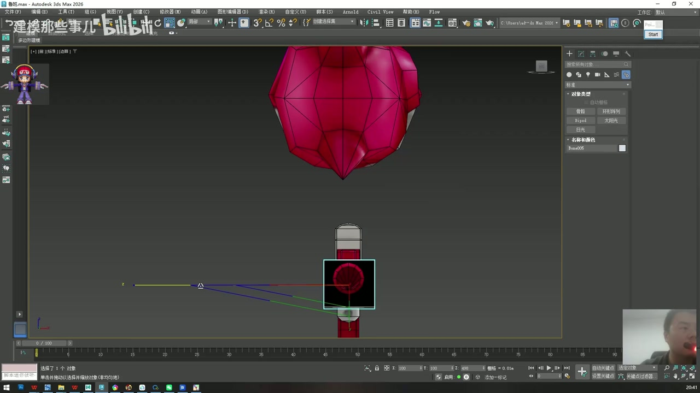
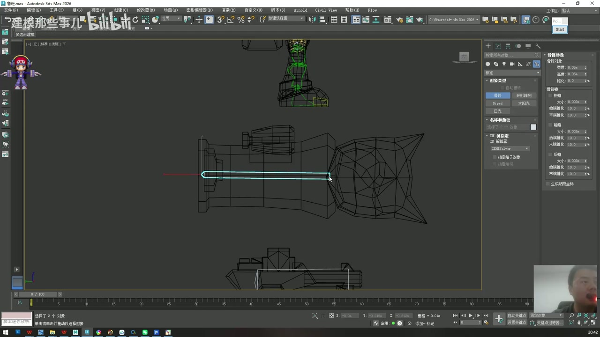
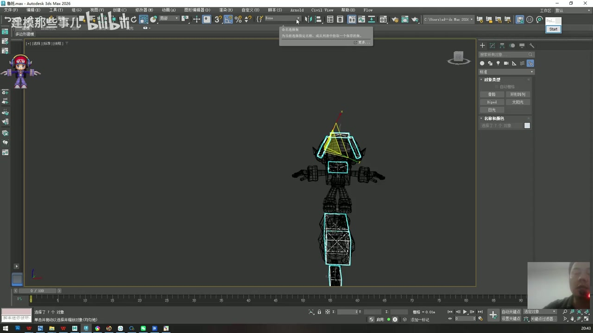
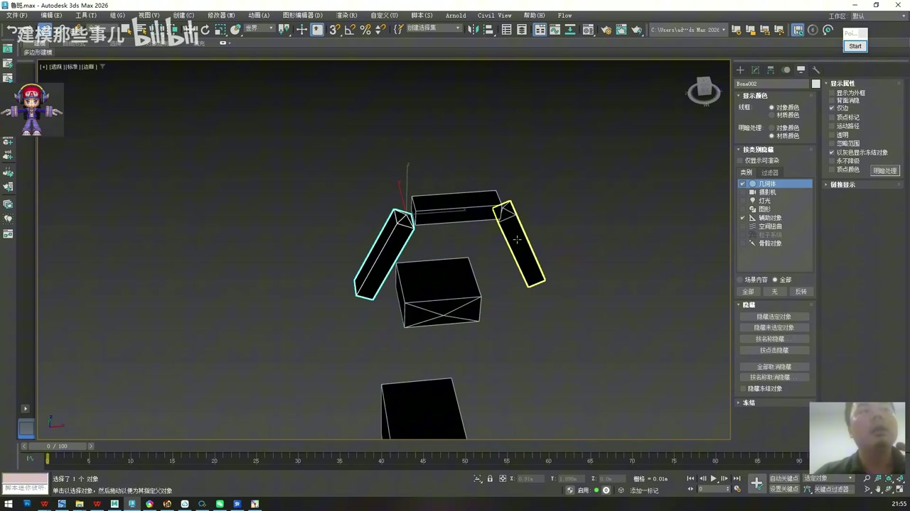
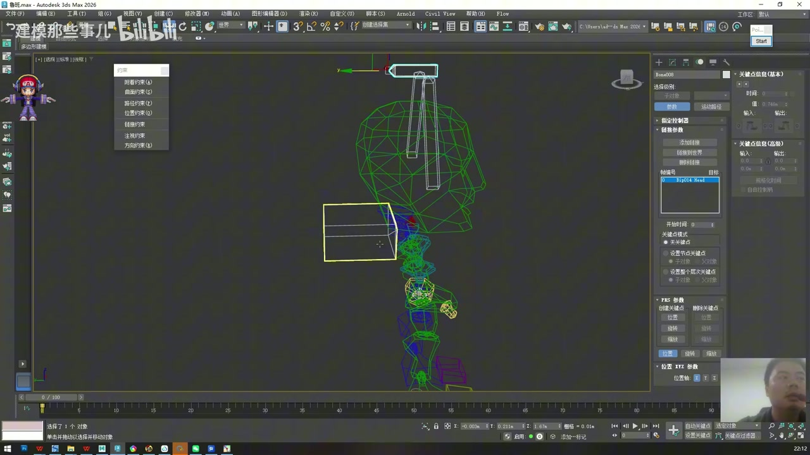

# 3ds Max 2026 鲁班七号骨骼绑定教程 02：附属骨骼与约束连接

资料来源：

- 视频：原始视频仍保存在 `F:\workspace\open-share\video-downloads\BV1ftReBYEg3\`
- 逐字稿：`transcripts/BV1ftReBYEg3_transcript_cleaned.txt`
- 整理范围：`00:52:00` 到 `01:32:20`

说明：这一段接在前 52 分钟的人体 Biped 骨架之后，重点是给耳机、背包、枪、炮弹等附属装备创建 Bones 骨骼，并把这些 Bones 骨骼和 Biped 主骨架建立正确的父子或约束关系。逐字稿里“半骨骼/棒骨骼”按上下文统一理解为 3ds Max 的 `Bones` 系统。

## 1. 本阶段目标

这一阶段完成 4 件事：

1. 确认人体 Biped 骨架已经匹配完成，并保存文件。
2. 根据道具的动画需求，为耳机、背包、枪、炮分别创建 Bones 骨骼。
3. 整理模型、Biped、Bones 三类对象，避免后续蒙皮时选错。
4. 用链接或链接约束把附属装备骨骼接到 Biped 主骨架上。

操作建议：人体骨架完成后先 `Ctrl + S` 保存一次。后面的附属骨骼、约束、蒙皮都是连续步骤，中间出错时有一个干净的回退点会省很多时间。

## 2. 为什么附属装备也要做骨骼

时间码：`00:53:15 - 00:54:20`

鲁班七号身上不只有人体结构，还有耳机、背包、武器、炮弹等道具。这些道具是否需要骨骼，不取决于模型是否复杂，而取决于它们是否有独立动画需求。

判断方式：

- 跟身体完全绑定、不会单独动的装饰，可以只交给身体骨骼或简单权重处理。
- 有取下、打开、摆动、发射、跟随延迟等动作需求的道具，要单独建骨骼。
- 如果一个道具内部还有多个可动部分，就要拆成多个骨骼。

本案例里：

| 道具 | 动画需求 | 骨骼方案 |
| --- | --- | --- |
| 耳机 | 可戴上、取下，两侧可掰开 | 1 根主骨骼，加左右侧骨骼 |
| 背包 | 跟随肩膀和身体运动 | 1 根主骨骼 |
| 枪 | 作为整体跟随 | 1 根骨骼 |
| 炮 | 炮管和炮弹有不同运动 | 至少 2 根骨骼 |

## 3. 创建耳机主骨骼

时间码：`00:54:20 - 00:57:10`

耳机是这一段最典型的道具，因为它既要作为一个整体跟随头部，又要保留两侧单独打开的能力。

操作流程：

1. 切换到创建面板，选择 `Systems > Bones`。
2. 使用顶视图或正交视图创建耳机主骨骼。
3. 将骨骼的 `Taper` 调为 `0`，让骨骼首尾粗细一致。
4. 根据模型比例调小骨骼宽度，例如示范里大致调到 `0.05` 级别，避免骨骼遮挡模型。
5. 删除末端多余的小骨段，只保留需要控制的主体骨骼。
6. 在顶视图、侧视图、透视图中反复检查位置，让主骨骼位于耳机整体结构中心。

注意点：

- 老师这里强调的是个人工作习惯：Bones 默认有锥度，但道具骨骼为了好看、好选、好判断方向，可以调成等粗。
- 骨骼大小不影响最终蒙皮逻辑，但会影响选择效率。太小难选，太大挡视图。
- 放骨骼时不要只看一个视图。顶视图定左右和前后，侧视图定高度，透视图检查整体关系。

## 4. 创建耳机左右侧骨骼

时间码：`00:57:10 - 01:00:30`

耳机两侧可以像真实耳机一样掰开，所以主骨骼之外还要为两侧耳罩或耳柄各放一根子骨骼。

操作流程：

1. 先在一侧创建一根侧边 Bones 骨骼，放到耳机侧边结构上。
2. 删除不需要的末端小骨段。
3. 把骨骼缩放到合适尺寸，让它覆盖侧边可动结构。
4. 通过镜像或复制的方式得到另一侧骨骼。
5. 调整镜像出来的骨骼位置和方向，确保左右结构对称。
6. 如果镜像轴不稳定，先把轴心或参考中心对到世界坐标中心，再做左右镜像。

这一段的关键不是“必须几个骨骼”，而是“动作决定骨骼”。耳机如果只是一个静态装饰，一根骨骼甚至不单独建骨骼也能处理；但因为它有左右掰开的动画需求，所以左右两侧需要单独控制。

## 5. 创建背包骨骼

时间码：`01:00:30 - 01:02:00`

背包的动作主要是跟随肩膀、胸腔和身体运动。它不需要像耳机一样拆成多段，因此一根主骨骼就够。

操作流程：

1. 选择 `Systems > Bones`。
2. 从肩膀附近点击第一下。
3. 向背包主体方向拉出骨骼。
4. 删除末端多余骨段。
5. 适当放大骨骼，方便后续动画或权重操作时选择。

重要细节：创建 Bones 时，第一下点击的位置就是这根骨骼的主控起点。背包是背在肩膀上的，所以第一点应靠近肩部，而不是随便点在背包几何中心。

## 6. 创建枪和炮的骨骼

时间码：`01:02:00 - 01:03:50`

枪的结构比较简单，示范里作为一个整体运动，所以只放一根骨骼。

枪的处理方式：

1. 用 Bones 从枪身方向拉出一根骨骼。
2. 删除末端多余骨段。
3. 缩放到容易选择、又不遮挡模型的尺寸。
4. 从正视图和侧视图确认它覆盖枪身主体。

炮的逻辑更复杂，因为炮弹可以发射出去，炮管和炮弹不是同一个运动单位。

炮的处理方式：

1. 为炮管或炮身创建一根骨骼，负责整体跟随。
2. 为炮弹单独创建一根骨骼，负责发射动作。
3. 删除多余末端骨段。
4. 同时选择两根骨骼，适当调大显示尺寸。
5. 后面通过链接或约束，让炮弹可以跟随炮管，也能单独做发射动画。

判断规则：道具是否拆骨骼，要看它在动画里能不能拆开运动。炮弹能飞出去，所以不能只交给炮管骨骼。

## 7. 整理模型、Biped 和 Bones

时间码：`01:03:50 - 01:05:10`

附属骨骼创建完成后，要先做对象整理。老师把对象大致分成三类：模型、Biped 骨骼、Bones 骨骼。

建议整理方式：

| 类型 | 内容 | 用途 |
| --- | --- | --- |
| 模型组 | 角色身体、道具网格 | 后续添加 Skin 修改器 |
| BIP 组 | 人体 Biped 骨架 | 主控制骨架 |
| BONE 组 | 耳机、背包、武器等 Bones | 附属装备控制 |

操作建议：

- 每做完一类对象就保存一次。
- 暂时不操作的对象可以隐藏，减少误选。
- 绑定教程里“看起来只是整理”的步骤很重要，因为后面蒙皮添加骨骼时会大量框选对象。

## 8. 理解链接关系：父物体和子物体

时间码：`01:05:10 - 01:14:00`

在把道具骨骼接到主骨架之前，先要理解父子关系。

核心逻辑：

- 父物体移动，子物体跟着移动。
- 子物体仍然可以单独移动或旋转。
- 绑定里常用这种逻辑做“身体带动装备，装备又保留自己的局部动作”。

普通链接的基本操作：

1. 先选择要被带动的子物体。
2. 点击工具栏里的链接工具。
3. 按住鼠标从子物体拖到父物体。
4. 父物体边缘高亮后松开。
5. 移动父物体检查子物体是否跟随。
6. 单独移动子物体，确认它仍能独立做局部动作。

老师在这一段演示时多次遇到链接后骨骼旋转异常或变形的问题。这里要记住一个实战经验：骨骼绑定是很理性的流程，前一步的轴向、模式、创建顺序或位置不对，后一步就会暴露问题。发现异常时，不要硬做下去，先回到骨骼创建和轴向设置检查。

## 9. 链接约束与问题排查

时间码：`01:14:00 - 01:27:00`

当普通链接不能得到想要的结果时，可以尝试 `Animation > Constraints > Link Constraint`，也就是链接约束。示范里老师尝试了普通链接、链接约束、重新创建骨骼、调整骨骼模式等方式，直到旋转和跟随结果正常。

排查顺序：

1. 检查是不是选错了父物体和子物体。
2. 检查骨骼创建方向是否正确。
3. 检查骨骼是否有多余末端或异常段。
4. 检查轴心、坐标系和镜像方式是否合理。
5. 如果骨骼已经出现异常，直接重建往往比继续修更快。
6. 链接后一定要旋转和移动测试，而不是只看层级是否建立。

这一段不是单纯教一个按钮，而是在展示绑定工作真实的调试方式：有问题就拆回上一步，找到原因，再继续。

## 10. 把附属 Bones 连接到 Biped

时间码：`01:27:00 - 01:32:20`

最后一步是把独立的 Bones 骨骼连接到人体 Biped 上。原则很明确：Biped 是主体，装备 Bones 是次级物体。

连接关系建议：

| 附属骨骼 | 应连接到的主体骨骼 | 原因 |
| --- | --- | --- |
| 耳机主骨骼 | 头部 Biped 骨骼 | 头动时耳机跟着动 |
| 耳机左右侧骨骼 | 耳机主骨骼 | 主骨骼带动整体，侧骨骼可单独张开 |
| 背包骨骼 | 胸腔、肩部或上身 Biped 骨骼 | 背包跟随上半身 |
| 枪骨骼 | 对应手部、手臂或武器挂点 | 武器跟随角色动作 |
| 炮管骨骼 | 对应身体或武器主体 | 炮作为装备跟随身体 |
| 炮弹骨骼 | 炮管骨骼或发射控制骨骼 | 炮弹先跟随炮管，再单独发射 |

操作检查：

1. 移动头部骨骼，耳机主骨骼应跟着动。
2. 单独旋转耳机侧骨骼，左右耳罩应保留局部控制能力。
3. 移动胸腔或肩部骨骼，背包应跟着动。
4. 移动炮管骨骼，炮弹应跟随；单独移动炮弹骨骼时，炮弹也应能脱离做发射动作。
5. 如果某个道具跟错骨骼，立刻断开或重做链接，不要进入蒙皮后再补救。

## 11. 本篇完成标准

完成这一部分后，文件应满足以下状态：

- 人体 Biped 骨架已经退出体型模式前的最终匹配状态。
- 耳机、背包、枪、炮管、炮弹都有各自的 Bones 骨骼。
- 模型、BIP、BONE 三类对象已经整理清楚。
- 附属 Bones 和 Biped 主骨架的父子或约束关系已经建立。
- 移动主骨骼时，道具能跟随；移动道具子骨骼时，局部动作仍然可控。
- 保存一次文件，再进入下一篇的 Skin 蒙皮阶段。
