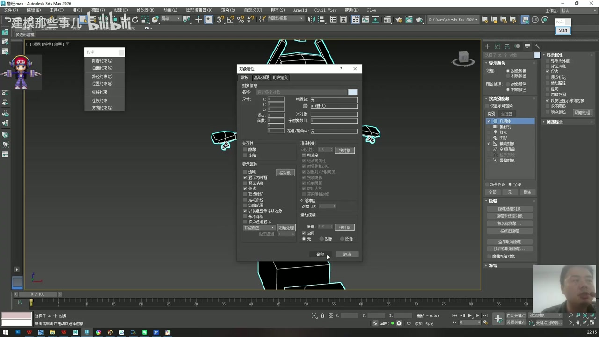
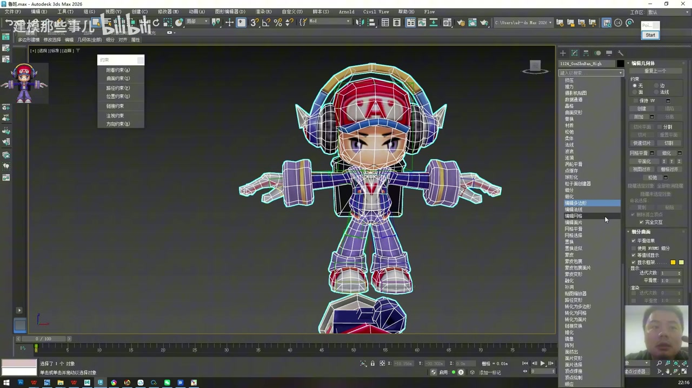
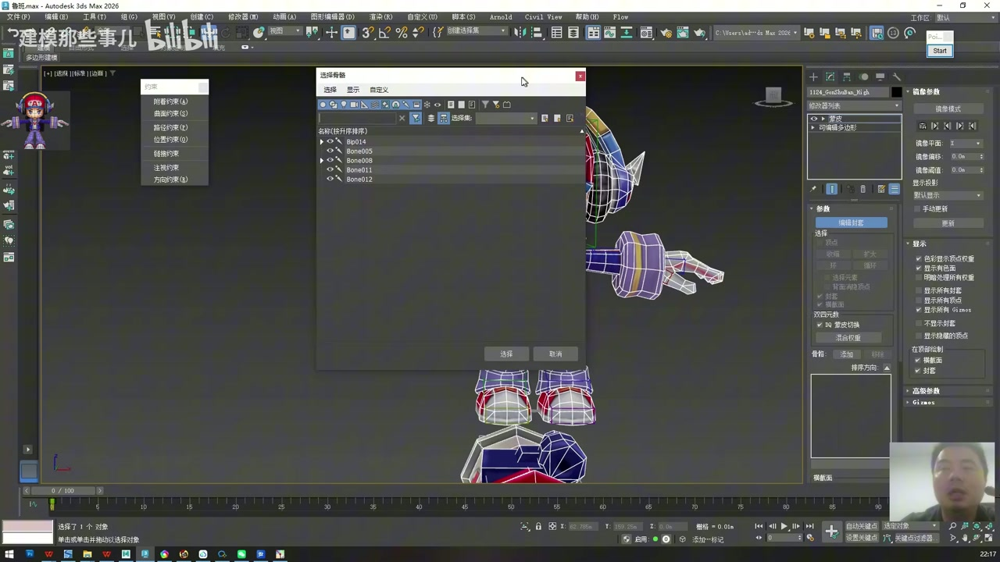
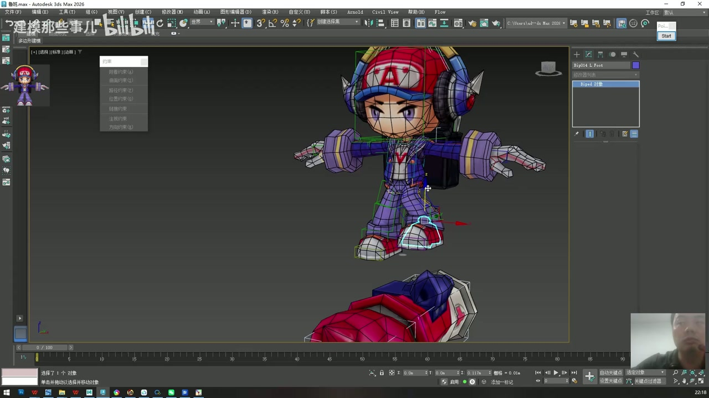
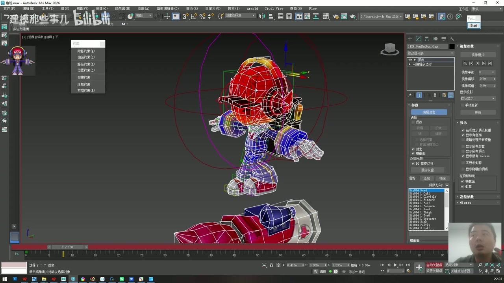
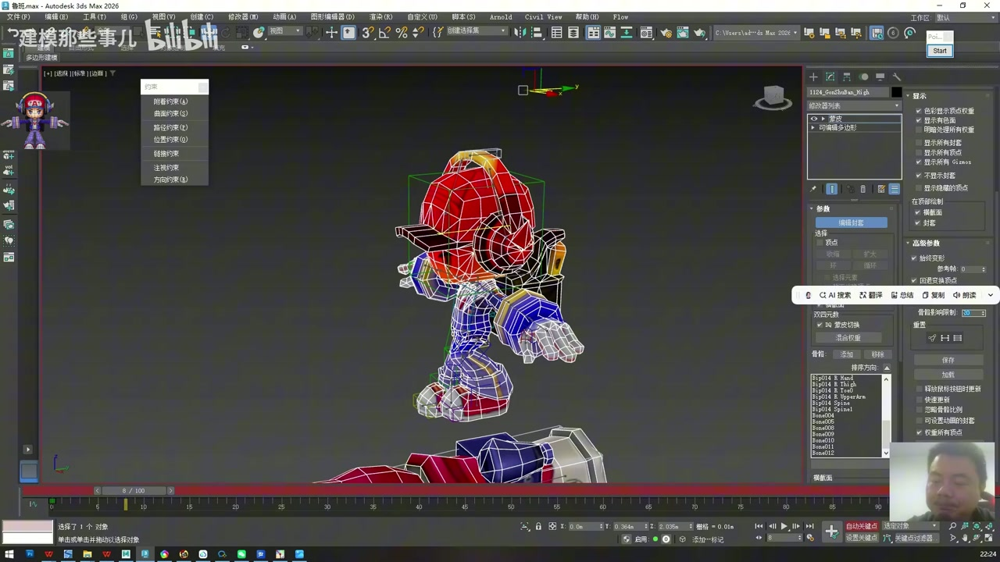
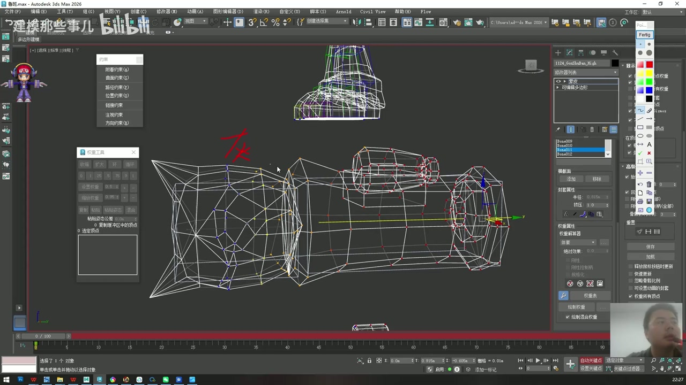
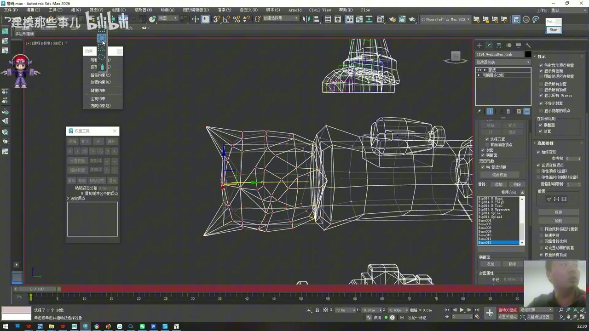
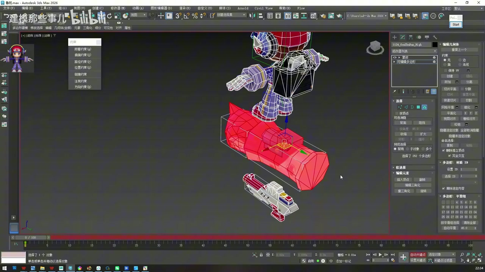

# 3ds Max 2026 鲁班七号骨骼绑定教程 03：Skin 设置与道具权重

资料来源：

- 视频：原始视频仍保存在 `F:\workspace\open-share\video-downloads\BV1ftReBYEg3\`
- 逐字稿：`transcripts/BV1ftReBYEg3_transcript_cleaned.txt`
- 整理范围：`01:32:20` 到 `01:55:30`

说明：这一篇从“开始蒙皮”整理到“先把简单道具权重处理完”。这里的重点不是身体复杂权重，而是先建立 Skin 系统，理解权重颜色和骨骼影响范围，再把炮弹、炮管、枪、背包、耳机这类刚性道具逐个绑定干净。

## 1. 本阶段目标

这一阶段完成 5 件事：

1. 把所有骨骼设置为外框显示，方便选模型和看包裹关系。
2. 给模型添加 `Skin` 修改器。
3. 把 Biped 和 Bones 添加进 Skin 的骨骼列表。
4. 理解 Envelope、骨骼影响限制、权重颜色。
5. 先处理道具类刚性部件的权重，并把完成的部分隐藏。

## 2. 蒙皮前先调整骨骼显示

时间码：`01:32:20 - 01:33:10`

蒙皮前先把骨骼显示成外框或盒状。这一步不是必须的数学操作，但对操作体验很重要。

操作流程：

1. 显示所有骨骼对象。
2. 选中 Biped 和 Bones。
3. 右键打开 `Object Properties`。
4. 勾选 `Display as Box` 或中文界面里的“显示为外框”。
5. 确认后返回视图。

这样做的好处：

- 骨骼不会大面积遮挡模型。
- 选择模型时不容易被实体骨骼挡住。
- 后面看 Skin 包裹关系时，骨架结构更清晰。

## 3. 添加 Skin 修改器

时间码：`01:33:10 - 01:34:25`

蒙皮的对象是模型，不是骨骼。逻辑是“骨骼驱动模型”，所以 Skin 修改器必须加在模型上。

操作流程：

1. 选中角色模型。
2. 打开修改器列表。
3. 找到 `Skin`，中文界面通常显示为“蒙皮”。
4. 确认选择的是 `Skin/蒙皮`，不是 `Skin Wrap/蒙皮包裹`，也不是其他类似修改器。
5. 添加后进入 Skin 参数面板。

注意：如果模型是由身体、装备、武器合并成一个大对象，Skin 会作用在整个对象上。后面刷权重时要通过元素、顶点、骨骼列表去分区处理。

## 4. 将骨骼加入 Skin 系统

时间码：`01:34:25 - 01:35:40`

添加 Skin 以后，模型还不知道由哪些骨骼驱动。需要把 Biped 和附属 Bones 加入 Skin 的骨骼列表。

操作流程：

1. 在 Skin 修改器中打开 `Edit Envelopes`。
2. 点击 `Add` 添加骨骼。
3. 在列表中选择需要参与蒙皮的 Biped 和 Bones。
4. 可以用 `Ctrl + A` 选中主要骨骼，再手动排除不需要的小辅助对象。
5. 确认添加后，骨骼列表会出现在 Skin 面板中。

添加原则：

- 参与驱动模型顶点的骨骼要加入。
- 只是辅助显示、无实际权重需求的对象可以不加。
- 道具 Bones 如果要控制道具模型，也要加入。
- 添加后不要急着刷，先做一次简单测试。

## 5. 测试初始蒙皮结果

时间码：`01:35:40 - 01:38:20`

刚添加 Skin 后，模型会开始跟随骨骼，但初始结果通常不好。很多顶点会被错误骨骼影响，这正是接下来刷权重要解决的问题。

测试方式：

1. 选择一根明显的骨骼，例如头、手臂、炮管。
2. 轻微移动或旋转。
3. 观察哪些模型部分跟着动。
4. 如果不该动的地方被带动，说明权重还没处理好。
5. 记录明显问题，但不要在这个阶段急着修每个点。

老师在这一段强调：蒙皮完成只是“模型和骨骼建立关系”，后续权重才决定哪个顶点该听谁的。

## 6. 理解 Envelope 包裹范围

时间码：`01:38:20 - 01:41:00`

`Envelope` 可以理解为骨骼影响范围的可视化。它会显示某根骨骼大致能影响哪些顶点。

以头部骨骼为例：

- 头部骨骼主要应该影响头部。
- 颈部附近可以有过渡影响。
- 身体、手臂、腿不应该被头部骨骼大量影响。

Envelope 可以帮助你判断大方向，但不能完全替代权重调整。最终是否正确，要看模型在动画测试中是否变形自然。

## 7. 设置骨骼影响限制

时间码：`01:41:00 - 01:42:00`

默认情况下，一个顶点可能会被很多骨骼同时影响。示范里老师把骨骼影响限制调整到 `3`，让每个顶点最多受 3 根骨骼影响。

操作位置：

1. 在 Skin 修改器参数中找到高级设置。
2. 找到类似 `Bone Affect Limit` 的参数。
3. 将默认较大的数值改成 `3`。

这样做的目的：

- 减少远处骨骼对顶点的错误影响。
- 让权重关系更可控。
- 更符合游戏角色绑定里常见的性能和清晰度要求。

注意：`3` 不是绝对规则，但对这类卡通游戏角色是一个清晰、实用的起点。

## 8. 认识权重颜色

时间码：`01:42:00 - 01:45:00`

进入权重编辑后，颜色能帮助判断顶点受当前骨骼控制的程度。

常见理解：

| 颜色状态 | 权重含义 |
| --- | --- |
| 灰色或暗色 | 当前骨骼影响为 `0` |
| 红色 | 当前骨骼影响为 `1`，完全控制 |
| 中间颜色 | 部分影响，例如 `0.25`、`0.5`、`0.75` |

刷权重时要先确认当前选中的是哪一根骨骼线，再选择对应顶点或元素。如果骨骼选错，权重会刷到错误对象上。

## 9. 道具权重的基本流程

时间码：`01:45:00 - 01:49:20`

炮弹、炮管、枪、背包、耳机这类道具大多是刚性部件。刚性部件的目标很简单：整个元素完全听某一根骨骼，权重值通常直接给 `1`。

通用流程：

1. 选中模型，进入 Skin 修改器。
2. 打开 `Edit Envelopes`。
3. 在骨骼列表或视图中选中对应骨骼线。
4. 切换到顶点或元素选择。
5. 选中这个道具对应的所有顶点。
6. 在权重工具里把权重设为 `1`。
7. 如果出现 `0` 权重残留，执行“移除 0 的权重值”。
8. 移动该骨骼测试道具是否完整跟随。

道具处理建议：

| 道具 | 典型权重 |
| --- | --- |
| 炮弹 | 炮弹骨骼 `1` |
| 炮管 | 炮管骨骼 `1` |
| 枪 | 枪骨骼 `1` |
| 背包 | 背包骨骼 `1`，必要时肩带可后续微调 |
| 耳机整体 | 耳机主骨骼 `1`，左右侧结构按动画需求再分配 |

## 10. 做完一个就隐藏一个

时间码：`01:49:20 - 01:55:30`

示范里老师处理完炮弹、炮管、背包、耳机等简单部件后，会把已经完成的模型元素和对应骨骼隐藏掉。

这样做的好处：

- 视图更干净。
- 不容易误选已经完成的道具顶点。
- 剩下的工作范围越来越小。
- 最后处理身体权重时，注意力集中在角色主体上。

隐藏模型元素的常用流程：

1. 选择模型对象。
2. 进入 `Editable Poly` 或可编辑多边形级别。
3. 如果弹出修改器相关提示，按老师示范选择暂存或保留当前堆栈的方式继续。
4. 进入元素模式。
5. 选中已经刷完权重的道具元素。
6. 点击隐藏选中。
7. 对对应骨骼也可以右键隐藏。
8. 需要恢复时使用全部取消隐藏。

操作节奏：先做简单的，做完就藏起来，最后把最复杂的人体留出来慢慢刷。这个顺序能明显减少混乱。

## 11. 本篇完成标准

完成这一部分后，文件应满足以下状态：

- 模型已经添加 Skin 修改器。
- Biped 和附属 Bones 已经加入 Skin 骨骼列表。
- 骨骼影响限制已调整到适合项目的范围，示范值为 `3`。
- 炮弹、炮管、枪、背包、耳机等刚性道具已经有明确权重。
- 每个道具移动测试时只跟随自己的骨骼，不再被其他骨骼误带。
- 已经完成的道具元素和骨骼可以隐藏，准备进入身体权重处理。
