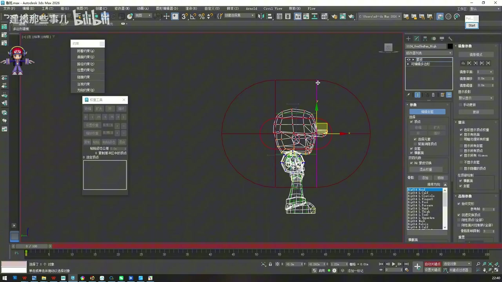
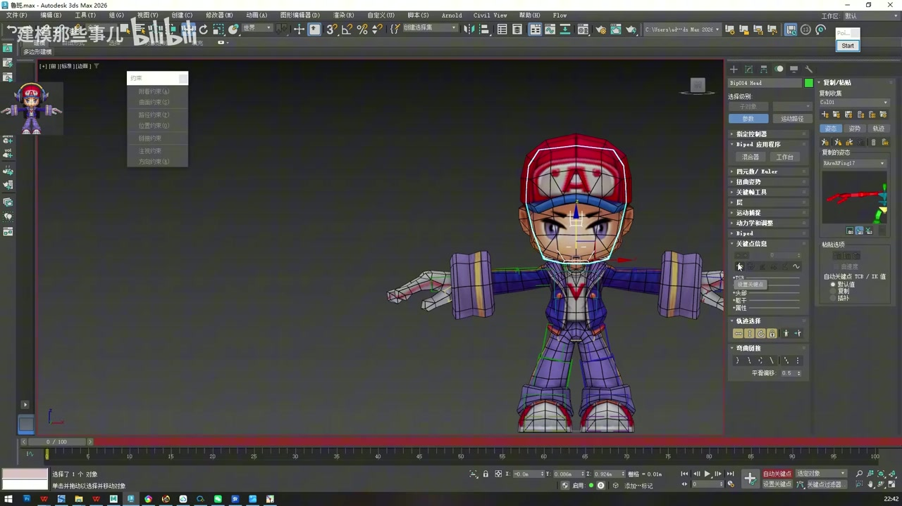
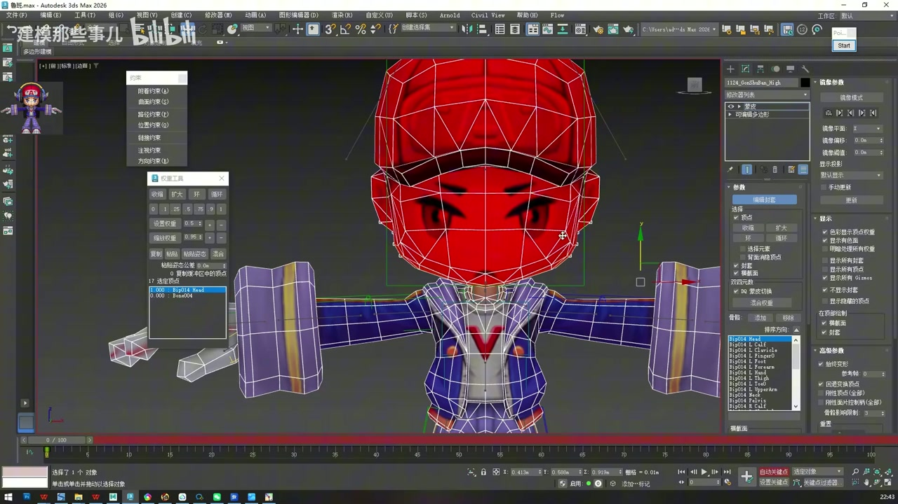
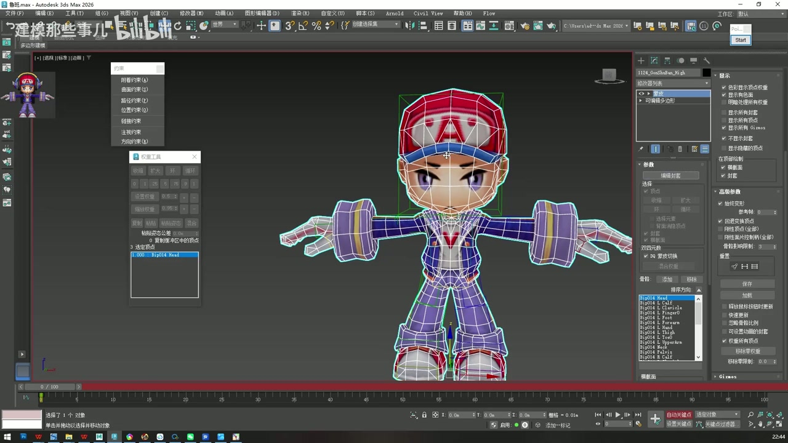
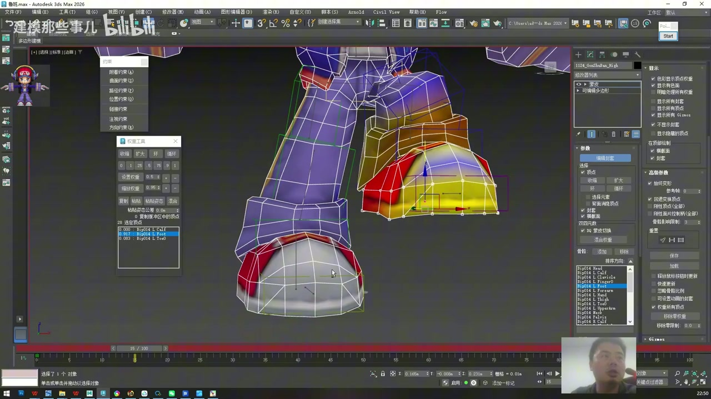
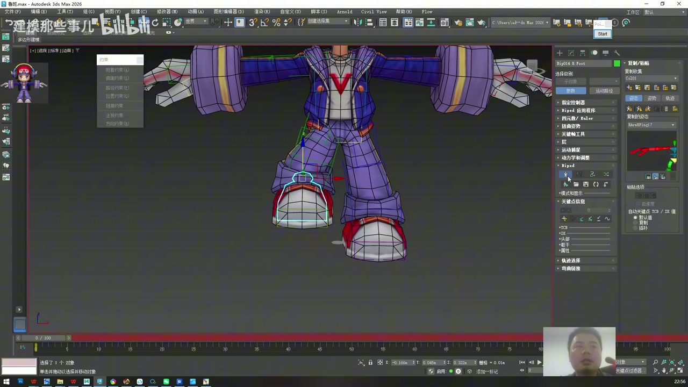
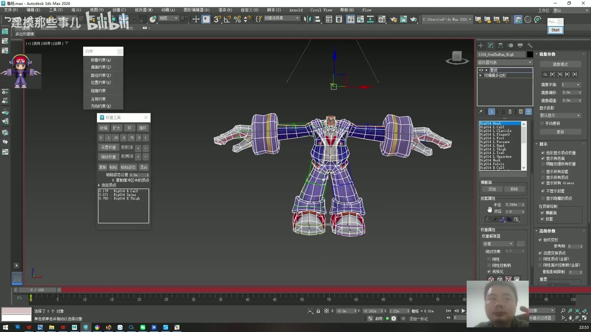
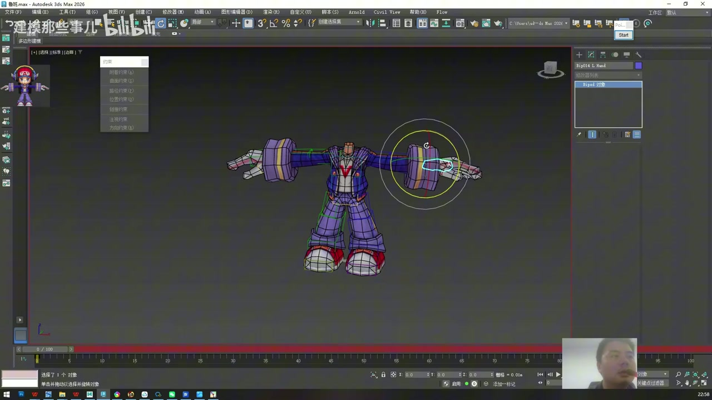

# 3ds Max 2026 鲁班七号骨骼绑定教程 04：身体权重与最终检查

资料来源：

- 视频：原始视频仍保存在 `F:\workspace\open-share\video-downloads\BV1ftReBYEg3\`
- 逐字稿：`transcripts/BV1ftReBYEg3_transcript_cleaned.txt`
- 整理范围：`01:55:30` 到 `02:15:25`

说明：这一篇整理最后阶段的身体权重、头颈测试、错误权重修正、镜像权重和最终检查。视频后段是边操作边排查，重点是把老师的检查思路转成可复用的操作流程。

## 1. 本阶段目标

这一阶段完成 5 件事：

1. 从相对简单的头部开始处理身体权重。
2. 用测试动画检查权重，而不是只看静态颜色。
3. 修正错误影响，例如脚、腿、身体被远处骨骼带动。
4. 使用镜像模式把一侧权重复制到另一侧。
5. 取消隐藏全部模型和骨骼，做最终动作检查并保存。

## 2. 身体权重为什么更难

时间码：`01:55:30 - 01:56:30`

身体权重比道具难，因为一个身体部位经常受多个骨骼共同影响。比如脖子和头之间要过渡，肩膀和手臂之间要过渡，腿部和脚部也要处理弯曲。

道具权重常常可以直接给 `1`，身体权重则要解决两个问题：

- 哪些顶点完全跟随某根骨骼。
- 哪些顶点需要在多根骨骼之间平滑过渡。

因此老师的顺序是：先处理简单的头部，再逐步扩大到身体其他区域。

## 3. 从头部骨骼开始

时间码：`01:56:30 - 01:59:00`

头部是身体里相对简单的部位。头整体跟随头骨，颈部区域再做适当过渡。

操作流程：

1. 选中模型，进入 Skin 修改器。
2. 打开 `Edit Envelopes`。
3. 选中头部骨骼线。
4. 调整头部骨骼的 Envelope，让它主要覆盖头部和颈部附近。
5. 避免头部骨骼影响身体、手臂、腿等无关区域。

操作判断：

- 头部大面积顶点可以接近 `1`。
- 脖子下方需要保留过渡，不要硬切。
- 如果身体远处出现颜色或运动影响，说明有多余权重需要清理。

## 4. 框选头部顶点并赋权

时间码：`01:59:00 - 02:03:00`

为了快速选中头部顶点，老师使用类似套索的选择方式，把头部区域框出来，再对当前骨骼赋权。

操作流程：

1. 在 Skin 中保持头部骨骼为当前骨骼。
2. 切换到顶点选择。
3. 使用框选或套索选中头部顶点。
4. 把这些顶点对头骨的权重设为 `1`。
5. 对颈部过渡顶点，根据变形效果给 `0.5`、`0.75` 等过渡值。
6. 执行移除 0 权重，清掉无效残留。

注意：不要只按颜色判断完成。头部看起来全红，不代表动作一定正确。下一步必须做运动测试。

## 5. 用临时动画检查权重

时间码：`02:03:00 - 02:06:00`

老师反复用临时动作来检查权重，例如在时间轴上移动头部、旋转骨骼，再观察模型哪里跟着动。

测试流程：

1. 在第 0 帧保持绑定初始姿势。
2. 到后面的帧，例如 10 帧或 20 帧，轻微移动或旋转测试骨骼。
3. 观察当前骨骼应该影响的区域是否跟随。
4. 观察不应该影响的区域是否被带动。
5. 回到第 0 帧继续修改权重。
6. 修改后再播放或拖动时间轴复查。

检查标准：

- 头动时，头部应完整跟随。
- 脖子附近允许有适当过渡。
- 身体、脚、手、道具不应因为头骨而乱动。

临时测试动作只是检查工具，最终保存前要确认角色回到正确姿态，测试关键帧是否需要清理也要按项目要求处理。

## 6. 用增量方式细调权重

时间码：`02:06:00 - 02:08:00`

身体权重不一定每次都直接输入 `1` 或 `0`。老师在示范中多次使用增加、减少权重的方式，让过渡区域逐步接近合理结果。

常用策略：

- 完全跟随某根骨骼的刚性区域，给 `1`。
- 关节过渡区域，根据变形给 `0.25`、`0.5`、`0.75` 等中间值。
- 不该被当前骨骼影响的顶点，给 `0` 并移除 0 权重。
- 如果某块模型没跟上，就增加正确骨骼权重。
- 如果某块模型被错误带动，就减少或清除错误骨骼权重。

权重调整要小步测试。每改一小块就拖动时间轴看变形，避免最后问题堆在一起。

## 7. 修正错误影响

时间码：`02:08:00 - 02:11:00`

视频后段出现了典型问题：移动某个骨骼时，远处不该动的部位也被带动。这说明该部位顶点被错误骨骼分到了权重。

修正流程：

1. 通过测试动作找到异常区域。
2. 回到 Skin 的 `Edit Envelopes`。
3. 选中造成错误影响的骨骼线。
4. 选中异常区域的顶点。
5. 将这些顶点对当前错误骨骼的权重设为 `0`。
6. 执行移除 0 权重。
7. 再选中正确骨骼，把这些顶点分配给正确影响源。
8. 重新播放测试动作。

示例判断：

- 脚被头部或上身骨骼带动，清掉脚顶点对错误骨骼的权重。
- 腿部弯曲时边缘撕裂，把过渡顶点分给相邻腿骨。
- 颈部不跟头动，给头骨或脖子骨增加适量影响。

权重清理的关键是“先找错骨骼，再找错顶点”。如果只是盯着顶点乱加值，很容易越修越乱。

## 8. 镜像权重

时间码：`02:11:00 - 02:13:00`

如果一侧权重已经刷好，可以用 Skin 的镜像模式把权重复制到另一侧。老师特别区分了“镜像骨骼”和“镜像顶点权重”：这里要复制的是模型顶点权重。

操作流程：

1. 回到第 0 帧，避免在测试姿态下镜像。
2. 进入 Skin 的 `Edit Envelopes`。
3. 打开 `Mirror Mode` 或中文界面里的镜像模式。
4. 观察蓝色、绿色顶点对应关系。
5. 根据箭头方向选择从已完成一侧复制到另一侧。
6. 执行顶点权重镜像。
7. 退出镜像模式。
8. 再做左右动作测试。

注意点：

- 如果左右模型或骨骼不对称，镜像可能不准，需要手动补。
- 镜像前确保角色在初始姿势。
- 不要把“镜像骨骼线”和“镜像顶点权重”混为一谈。

## 9. 全部显示并最终检查

时间码：`02:13:00 - 02:15:25`

最后要把之前隐藏的道具、骨骼、模型元素全部显示出来，做一次整体检查。

最终检查清单：

1. 取消隐藏所有模型元素。
2. 取消隐藏所有 Biped 和 Bones。
3. 头部旋转检查，头和耳机是否一起动。
4. 胸腔或肩部检查，背包是否跟随。
5. 手臂、腿、脚做基础弯曲测试，观察是否撕裂或错误牵扯。
6. 炮管、炮弹、枪分别移动测试，道具是否只受正确骨骼控制。
7. 左右两侧动作对比，确认镜像权重没有反向或漏点。
8. 保存文件。

## 10. 本篇完成标准

完成这一部分后，文件应满足以下状态：

- 身体主要部位已经有可用权重。
- 头、脖子、身体过渡不会出现明显断裂。
- 错误远程影响已清理。
- 一侧完成的权重已按需镜像到另一侧。
- 所有隐藏元素已经恢复并通过整体动作测试。
- 绑定文件已经保存，可以进入后续动画测试或项目导出阶段。

补充建议：这节课最后的权重演示更像“示范方法”，不是逐点刷完商用最终权重。实际项目里还需要根据动作库继续压测，例如跑、跳、攻击、死亡、拿取装备、发射炮弹等动作，每个动作都可能暴露新的权重点。
